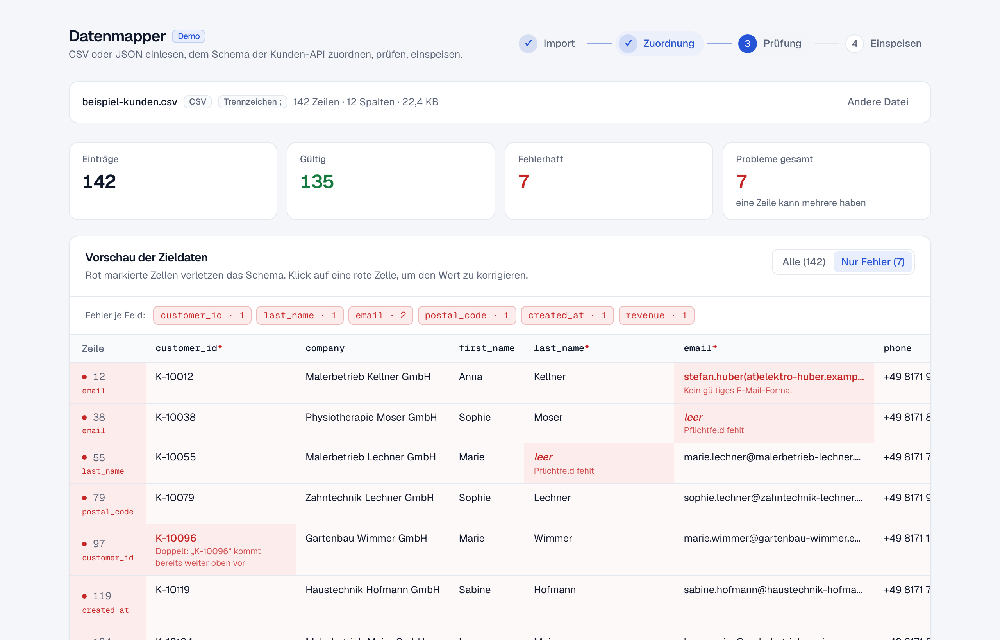
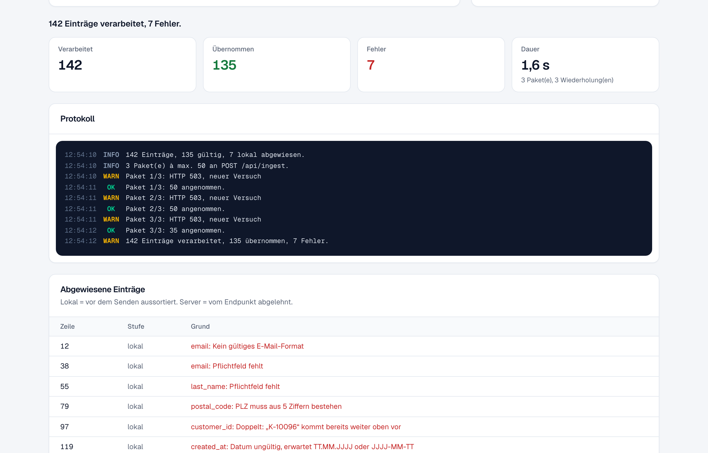

# Datenmapper

CSV- oder JSON-Datei einlesen, Spalten den Feldern einer Ziel-API zuordnen, Fehler vor dem Import
sichtbar machen und die gültigen Datensätze paketweise an einen REST-Endpunkt übertragen.
Eigenentwicklung von [BKS Technologies](https://bkstechnologies.de). Das Zielsystem ist simuliert.

| Zuordnung | Prüfung | Übertragung |
|:---:|:---:|:---:|
|  |  |  |

## Ablauf

1. **Import:** Drag-and-drop oder Dateiauswahl. CSV mit erkanntem Trennzeichen (`; , Tab |`),
   Anführungszeichen und Zeilenumbrüchen im Feld (RFC 4180) und BOM. JSON als Array oder als Objekt
   mit Array; verschachtelte Felder werden zu `adresse.plz`. Bis 10 MB. Die Datei wird nur im
   Browser gelesen.
2. **Zuordnung:** Je Zielfeld ein Dropdown mit den Quellspalten und Beispielwerten. Vorschlag nach
   Spaltennamen und Aliassen (`Kdnr_01` → `customer_id`). Pflichtfelder ohne Quelle sperren den
   nächsten Schritt.
3. **Prüfung:** Vorschau mit rot markierten Zellen: Pflichtfeld, E-Mail, PLZ, Telefon, Datum
   (auch 31.02.), Betrag in deutscher oder englischer Schreibweise, Dubletten bei eindeutigen
   Feldern. Filter „nur Fehler“ und je Feld. Rote Zellen lassen sich per Klick korrigieren.
4. **Übertragung:** Gültige Zeilen gehen in Paketen à 50 per `POST /api/ingest`. Der Endpunkt prüft
   jedes Paket mit demselben Schema noch einmal und antwortet je Zeile. Bei 5xx und 429 bis zu drei
   Versuche mit Backoff, Abbruch jederzeit. Der Schalter „Ausfall simulieren“ erzwingt beim ersten
   Versuch ein 503. Ergebnis, Protokoll, abgewiesene Zeilen und Exporte (API-JSON, gemappte CSV,
   Fehlerbericht).

## Entwicklung

```bash
npm install
npm run dev     # http://localhost:3000
npm test        # Vitest: Parser, Zuordnung, Prüfung, Beispieldatei
npm run lint
npm run build
node scripts/beispieldaten.mjs   # Beispieldateien in public/ neu erzeugen
```

Node 20 oder neuer. Keine Umgebungsvariablen, keine Datenbank.

## Aufbau

```
lib/schema.ts              Zielschema: Felder, Typen, Pflicht, Aliasse, Endpunkt, Paketgröße
lib/parse.ts               CSV- und JSON-Parser
lib/mapping.ts             Zuordnungsvorschlag, Anwenden der Zuordnung plus Korrekturen
lib/validate.ts            Prüfregeln und Umwandlung in typisierte API-Objekte (Browser und Server)
lib/push-engine.ts         Pakete, Wiederholung, Abbruch, Zusammenfassung
lib/export.ts              CSV-Erzeugung und Download
lib/state/mapper-store.tsx useReducer und Context; das Prüfergebnis wird abgeleitet, nie gespeichert
lib/legal.ts               Firmenangaben für Impressum und Datenschutz (Quelle: website/lib/site.ts)
app/api/ingest/route.ts    simuliertes Zielsystem: prüft, antwortet, speichert nichts
components/ui/             Button, Card, Badge, Select, Stat, Switch, Stepper
components/mapper/         Dropzone, MappingPanel, PreviewTable, PushPanel, ProtocolLog, MapperApp
```

**Anderes Zielsystem:** ein neues `TargetSchema` in `lib/schema.ts` anlegen und an
`<MapperProvider schema={…}>` übergeben. Für einen echten Endpunkt `endpoint` ändern und die
Antwort auf `{ received, accepted, rejected: [{ row, reasons }] }` abbilden (`lib/push-engine.ts`).

## Betrieb

- Sicherheits-Header und Content-Security-Policy in `next.config.ts` (nur eigene Quellen).
- `/api/ingest`: höchstens 1 MB und 500 Datensätze je Anfrage, 120 Anfragen pro Minute und IP
  je Instanz, kein Speichern.
- Keine Cookies, kein localStorage, keine Analyse. Impressum und Datenschutz unter `/impressum` und
  `/datenschutz` (Datenschutz ist als Entwurf gekennzeichnet).

### Deploy (Vercel)

1. Repo auf GitHub anlegen und pushen.
2. In Vercel importieren, Framework Next.js, Region **Frankfurt (fra1)**. Keine Variablen nötig.
3. Domain `datenmapper.bkstechnologies.de` im Projekt hinzufügen, bei IONOS einen CNAME
   `datenmapper` auf den Wert von Vercel setzen. MX-Einträge nicht anfassen.
4. Prüfen: Startseite, Beispiel-CSV bis zur Übertragung, `/impressum`, `/datenschutz`.

Die Beispieldateien in `public/` sind erfunden (Domains auf `.example`) und enthalten sieben
absichtlich fehlerhafte Zeilen.
